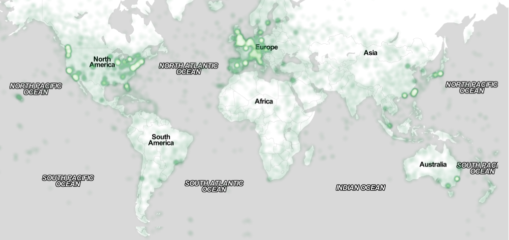

# Cheatsheet

Lite sätt att få in saker i Markdown:

## Referat

[@namefromsample.bib]

Lägger automagiskt till i referatlistan med.

## Bilder / figurer

Vill man ha dem i en kolumn (små bilder) kan man använda vanlig Markdown-syntax.

{#fig:map
width=80%}

Markdown-varianten kan man referera till med

```markdown
See Figure [@fig:map] for an example of the data visualization.
```

Annars kan man lägga in det med ren LaTeX också.

```latex
\begin{figure*}[ht]
  \centering
  \includegraphics[width=\textwidth]{style/figures/map.png}
  \caption{A visualization of the dataset across both columns.}
  \label{fig:map2}
\end{figure*}
```
